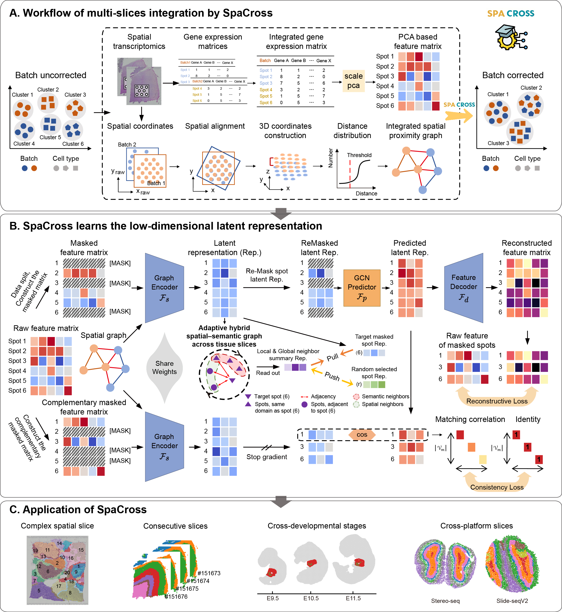

# SpaCross
## Overview
SpaCross is a comprehensive analytical framework designed for spatial transcriptomics data, aiming to enhance the accuracy of spatial pattern recognition and cross-slice consistency. The approach comprises key modules including data preprocessing, masked-enhanced self-supervised learning, hybrid graph modeling, and cross-slice integration, utilizing graph neural networks and contrastive learning to jointly model spatial and semantic information. 

To support the integrative analysis of multi-slice spatial transcriptomics data, SpaCross performs data preprocessing by first integrating gene expression matrices from multiple slices along the spot dimension. The data is then filtered and normalized to remove low-quality genes, retaining only highly variable genes for subsequent modeling. Next, principal component analysis (PCA) is applied for dimensionality reduction to decrease computational complexity. Subsequently, SpaCross incorporates a 3D spatial registration method, utilizing the iterative closest point (ICP) algorithm to align spatial coordinates across different slices and dynamically construct a 3D adjacency matrix, ensuring the continuity of spatial relationships. Based on the adjusted 3D spatial coordinates, Euclidean distances are computed to construct a k-nearest neighbor (k-NN) graph, thereby forming the topological structure of the spatial graph. This ensures that the model captures the spatial continuity of neighboring spots while preserving cross-slice semantic propagation (Fig. A). 

To enhance the model's robustness against missing data and noise, SpaCross introduces a cross-masked self-supervised learning mechanism (Fig. B). Specifically, two complementary masked views are randomly generated on the input features, serving respectively for feature reconstruction and latent space consistency learning. The masked feature matrix, which simulates missing information during training, improves the model’s imputation capability, while the complementary mask provides consistent supervision for the latent space, effectively mitigating overfitting in the autoencoder. The graph encoder, integrating feedforward neural networks and graph convolutional networks, leverages the graph structure to propagate features among neighboring nodes, resulting in more robust latent representations.

In the latent representation learning process, SpaCross further enhances the reliability of these representations through a cross-masked latent consistency (CMLC) mechanism (Fig. B). The model aligns latent embeddings generated from complementary views using contrastive learning, thereby reinforcing consistency across different views and ensuring stable feature representation even when handling incomplete data or diverse data augmentation views.

To address the insufficient integration of local and global information in SRT data, SpaCross has developed an adaptive hybrid spatial–semantic graph modeling method (Fig. B). Based on the latent embeddings, the model selects local spatial neighbors and global semantic cluster neighbors, fusing them into a unified mixed neighborhood. This strategy not only preserves spatial continuity but also introduces semantic consistency across regions, significantly enhancing the discriminative power in downstream tasks. By aggregating mixed neighborhood features and optimizing node embeddings with contrastive learning, the model effectively delineates the boundaries between different categories. 

In downstream tasks (Fig. C),  SpaCross enables complex spatial domain identification within tissue slices while preserving spatial continuity and clustering accuracy. It supports the integration of consecutive slices, cross-developmental stage comparisons, and cross-platform datasets. These capabilities provide a unified framework for spatial omics studies in development, disease, and cross-species research. 

## Installations
- NVIDIA GPU (a single Nvidia GeForce RTX 3090)
- `pip install -r requirement.txt`

## Data
All the datasets used in this paper can be downloaded from url：[https://zenodo.org/records/15090086](https://zenodo.org/records/15090086).

## Demos
We provide two types of usage examples for SpaCross:
- **Reproduction scripts** used to replicate the results in our manuscript are available in the [`reproduction`](Reproduction_Notebook) directory.
- **Step-by-step tutorials** for applying SpaCross to new datasets are provided in the [`tutorial`](Tutorial_Notebook) directory, including clustering and cross-stage integration examples.

## Contact details
If you have any questions, please contact fangdonghai@aliyun.com.
